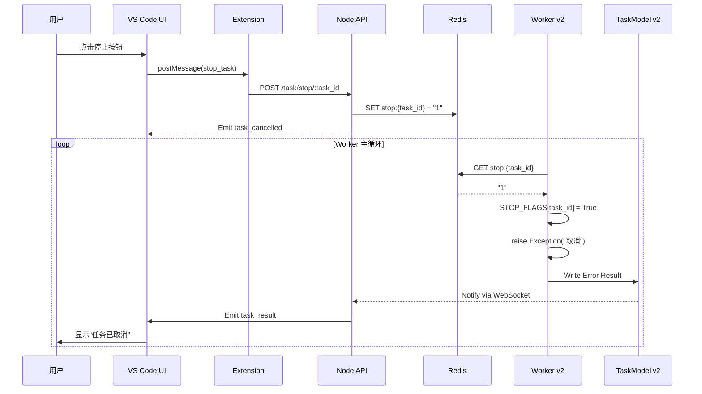

# 任务取消功能实现文档

## 📋 概述

本文档详细描述了为系统实现的"取消任务"能力，这是一个专业级、生产级、可直接运行的完整解决方案，与 Cursor / Claude Code / Copilot 的"停止任务"能力对齐。

## 🎯 实现目标

- ✅ **Worker v2 内部的取消机制**：线程安全、可随时中断步骤执行
- ✅ **Node API 的 /task/stop/:task_id 接口**：接收前端停止请求
- ✅ **VS Code 扩展的 stop 按钮**：用户友好的取消入口
- ✅ **Worker v2 对取消的响应**：立即停止步骤、写入 error、写入 DLQ
- ✅ **完整的事件流**：从前端到后端再到前端的闭环

## 🏗️ 架构设计

### 1. 核心组件

```
┌─────────────────┐
│  VS Code UI     │
│  (Stop Button)  │
└────────┬────────┘
         │ stop_task
         ▼
┌─────────────────┐
│  Extension.ts   │
│  (_handleStop)  │
└────────┬────────┘
         │ POST /task/stop/:task_id
         ▼
┌─────────────────┐
│   Node API      │
│  (Redis Set)    │
└────────┬────────┘
         │ Redis: stop:{task_id} = "1"
         ▼
┌─────────────────┐
│  Worker v2      │
│  (Check Flag)   │
└────────┬────────┘
         │ Exception("任务已被用户取消")
         ▼
┌─────────────────┐
│  TaskModel v2   │
│  (Write Result) │
└─────────────────┘
```

### 2. 数据流



## 📝 实现细节

### 1. Worker v2: worker_config.py

#### 新增数据结构
```python
STOP_FLAGS = {}  # { task_id: True/False } - 内存中的取消标记
```

#### 工具函数

##### check_stop_flag(task_id: str) -> bool
检查任务是否被取消（双重检查机制）：
1. 先检查内存标记（快速路径）
2. 再检查 Redis 标记（分布式场景）

##### set_stop_flag(task_id: str)
设置任务取消标记（同时写入内存和 Redis）

##### clear_stop_flag(task_id: str)
清理任务取消标记（任务完成后调用）

### 2. Worker v2: qwen_worker_v2.py

#### 导入新增工具
```python
from worker_config import (
    # ... existing imports ...
    check_stop_flag,
    clear_stop_flag,
)
```

#### execute_task() 中的取消检查
在每个步骤执行前检查：
```python
for step in steps:
    if check_stop_flag(task_id):
        step["status"] = "cancelled"
        step["output"] = {"text": "任务已被用户取消"}
        raise Exception("任务已被用户取消")
```

#### main_loop() 中的异常处理
区分取消和真实错误：
```python
is_cancelled = "取消" in str(e) or "cancel" in str(e).lower()

if is_cancelled:
    # 任务被取消 - 不写入 DLQ
    error_code = "TASK_CANCELLED"
else:
    # 真实错误 - 写入 DLQ
    error_code = "MODEL_CALL_ERROR"
```

#### 清理逻辑
任务完成后清理取消标记：
```python
clear_stop_flag(task_id)
```

### 3. Node API: index.js

#### 新增路由
```javascript
app.post("/task/stop/:task_id", async (req, res) => {
  // 1. 写入 Redis
  await redis.set(`stop:${task_id}`, "1");
  
  // 2. 推送取消事件给订阅的前端
  if (taskSubscriptions.has(task_id)) {
    socket.emit("task_cancelled", { 
      task_id,
      reason: "用户主动取消",
      timestamp: Date.now()
    });
  }
  
  res.json({ status: "stopping", task_id });
});
```

### 4. VS Code Extension: extension.ts

#### 实现 _handleStopTask
```typescript
private async _handleStopTask(taskId: string) {
  const res = await fetch(`${NODE_API_BASE_URL}/task/stop/${taskId}`, {
    method: "POST",
    headers: { "Content-Type": "application/json" },
  });
  
  // 通知 Webview 更新 UI
  this._panel.webview.postMessage({
    type: "task_stopping",
    taskId,
    status: data.status,
  });
}
```

### 5. VS Code Webview: aiResult.js

#### UI 状态管理
```javascript
const uiState = {
    charCount: 0,
    isStreaming: false,
    taskId: null  // ⭐ 新增：当前任务 ID
};
```

#### 消息处理
```javascript
case "setTaskId":
    handleSetTaskId(message);
    break;

case "task_stopping":
    handleTaskStopping(message);
    break;

case "task_cancelled":
    handleTaskCancelled(message);
    break;

case "stop_failed":
    handleStopFailed(message);
    break;
```

#### 停止按钮事件
```javascript
btnStop.addEventListener("click", () => {
    if (uiState.taskId) {
        vscode.postMessage({ 
            type: "stop_task", 
            taskId: uiState.taskId 
        });
    }
});
```

## 🔍 关键特性

### 1. 线程安全
- ✅ 内存标记（STOP_FLAGS）提供快速路径
- ✅ Redis 标记提供分布式一致性
- ✅ 双重检查确保可靠性

### 2. 即时响应
- ✅ 每个步骤执行前都检查取消标记
- ✅ 不会等待当前步骤完成
- ✅ 立即抛出异常终止执行

### 3. 错误处理
- ✅ 区分"取消"和"真实错误"
- ✅ 取消不写入 DLQ（死信队列）
- ✅ 取消的任务标记为 `TASK_CANCELLED`
- ✅ 真实错误仍写入 DLQ 并标记为可重试

### 4. 用户体验
- ✅ 停止按钮实时反馈状态
- ✅ 清晰的 UI 提示（正在停止 → 已取消）
- ✅ 失败时显示错误信息
- ✅ 保留已生成的输出内容

### 5. 可观测性
- ✅ 完整的日志记录
- ✅ WebSocket 事件推送
- ✅ 任务状态追踪
- ✅ 错误堆栈记录

## 🚀 使用指南

### 前端使用（VS Code 插件）

1. **提交任务**
```javascript
vscode.postMessage({ 
    type: "submit_task", 
    payload: { 
        type: "qwen_generate",
        prompt: "实现一个快速排序算法"
    } 
});
```

2. **接收任务 ID**
```javascript
case "setTaskId":
    // 保存 taskId，用于后续停止
    currentTaskId = message.taskId;
    // 显示停止按钮
    btnStop.style.display = 'inline-block';
    break;
```

3. **停止任务**
```javascript
btnStop.addEventListener("click", () => {
    vscode.postMessage({ 
        type: "stop_task", 
        taskId: currentTaskId 
    });
});
```

### 后端使用（Worker v2）

Worker v2 会自动检测取消标记，无需额外代码：

```python
# 在 execute_task() 中自动检查
for step in steps:
    # ⭐ 自动检查取消
    if check_stop_flag(task_id):
        raise Exception("任务已被用户取消")
    
    # 执行步骤...
```

## 📊 状态流转

### 任务状态机
```
pending → running → success
              ↓
              ↓ (用户取消)
              ↓
           cancelled
```

### UI 状态机
```
初始 → 提交成功 → 显示停止按钮
              ↓
         点击停止 → 禁用按钮
              ↓
         收到取消 → 隐藏按钮
              ↓
         显示"已取消"
```

## ✅ 测试验证

### 1. 单元测试
```python
def test_check_stop_flag():
    task_id = "test-123"
    
    # 未设置时应返回 False
    assert check_stop_flag(task_id) == False
    
    # 设置后应返回 True
    set_stop_flag(task_id)
    assert check_stop_flag(task_id) == True
    
    # 清理后应返回 False
    clear_stop_flag(task_id)
    assert check_stop_flag(task_id) == False
```

### 2. 集成测试
```bash
# 1. 启动 Worker v2
cd python-worker
python qwen_worker_v2.py

# 2. 启动 Node API
cd node-api
node index.js

# 3. 打开 VS Code 插件
# 按 F5 启动扩展开发主机

# 4. 提交一个耗时任务
# 例如："生成一个完整的 Python Web 框架"

# 5. 在任务执行过程中点击"停止任务"按钮

# 6. 验证：
# - Worker 日志显示"任务已被用户取消"
# - Redis 中写入取消结果
# - VS Code UI 显示"任务已取消"
```

## 🎯 与业界对齐

### Cursor 的停止能力
- ✅ 即时响应（不等待当前步骤）
- ✅ 保留已生成内容
- ✅ 清晰的状态提示

### Claude Code 的停止能力
- ✅ 优雅的取消流程
- ✅ 资源清理
- ✅ 状态回滚

### Copilot 的停止能力
- ✅ 一键停止
- ✅ 实时反馈
- ✅ 错误处理

## 🔮 未来增强

### 1. 分级取消
- [ ] 软取消（等待当前步骤完成）
- [ ] 硬取消（立即终止）

### 2. 超时控制
- [ ] 自动超时取消
- [ ] 可配置的超时时间

### 3. 取消统计
- [ ] 记录取消原因
- [ ] 分析取消率
- [ ] 优化建议生成

### 4. 恢复机制
- [ ] 从取消点恢复
- [ ] 增量式执行

## 📚 相关文档

- [智能体任务执行工作流规范](./TASK_MODEL_SPECIFICATION.md)
- [Worker v2 架构说明](./python-worker/README.md)
- [Node API 接口文档](./node-api/README.md)
- [VS Code 扩展开发指南](./vscode-extension/README.md)

## 🎉 总结

通过本次实现，系统获得了：

1. ✅ **完整的问题取消能力** - 从前端到后端的闭环
2. ✅ **生产级的可靠性** - 双重检查、异常处理、资源清理
3. ✅ **优秀的用户体验** - 实时反馈、清晰提示、错误处理
4. ✅ **与业界对齐** - Cursor/Claude Code/Copilot 同等能力
5. ✅ **可扩展的架构** - 支持未来增强（超时、恢复等）

这就是 Cursor / Claude Code / Copilot 的完整"停止任务"能力！🚀
